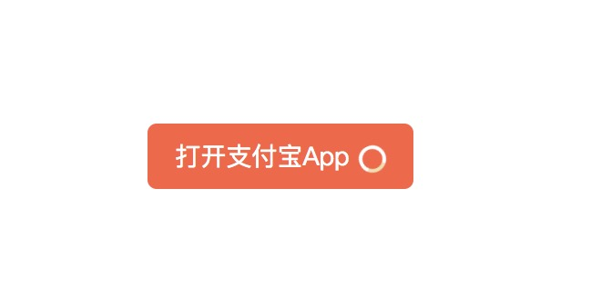

# [react-start-up-app](https://www.npmjs.com/package/@eleven.xi/react-start-up-app)

从浏览器 H5 启动手机 App，提供默认的启动按钮，根据需要去覆盖按钮的样式。

## Introduction

1. 当启动 App 成功时，App 调起在前台，浏览器被转入后台运行，浏览器的定时器会变慢，依靠这个机制去判断是否启动 App 成功，失败时执行 fail 回调。

2. 微信限制了启动 App，需要在 fail 启动失败回调函数里，判断后做另外处理，如：引导用户浏览器打开等。

## Installation

#### NPM

```js
npm i @eleven.xi/react-start-up-app
```

#### Yarn

```js
yarn add @eleven.xi/react-start-up-app
```

## Constants

| 参数名            | 类型          | 默认值      | 必填   | 说明     |
| ---------------- | ------------ | ---------- | ------ | --------------------------------------- |
| text             | String       | '打开 App'  | 否     | 按钮文案  |
| link             | String       | --         | 是     | 需要启动的 App 的 URL scheme，例如支付宝的是 'alipays://'  |
| isDisabled       | Boolean      | false      | 否     | 初始是否禁用按钮  |
| autoLoading      | Boolean      | true       | 否     | 过程中是否启用按钮 loading    |
| timeout          | Number       | 2300       | 否     | 预留的启动 App 时间，单位：毫秒    |
| fail             | Function     | --         | 是     | 启动失败时执行的回调函数，提供一个回调参数（isWeChat：是否是微信）  |
| ~~funcInWeixin~~ | ~~Function~~ | --         | ~~是~~ | ~~微信中执行此方法（微信自己的限制策略，无法启动 App），V 2.5.0 以后移除此参数，改为在 fail 方法中提供 isWeChat 回调参数，去处理微信的逻辑~~ |

## Getting Started

```js
// 启动支付宝 APP 示例
import StartUpApp from '@eleven.xi/react-start-up-app'

class App extends Component {
  // 启动失败（未安装 App），通常是前往下载 App；微信环境做另外处理。
  fail = isWeChat => {
    // isWeChat：是否是微信
    if (isWeChat) {
      alert(
        '微信屏蔽了直接唤起app（即使已安装了 App，也无法唤起），并且安卓、IOS微信有不同的限制策略，所以需要自己去做一点操作，例如：区分安卓、IOS，选择跳转对应下载页，或者跳app store、安卓应用市场，或其它操作。',
      )
      return
    }

    alert('启动失败（未安装 App）需要执行的操作，大多数时候是跳转app下载页.')
  }

  render() {
    return (
      <div className="demo-wrap">
        <StartUpApp
          text="打开支付宝App"
          isDisabled={false}
          autoLoading={true}
          link={'alipays://'}
          timeout={2300}
          fail={this.fail}
        />
      </div>
    )
  }
}
```


